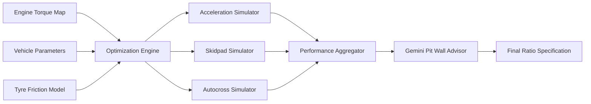
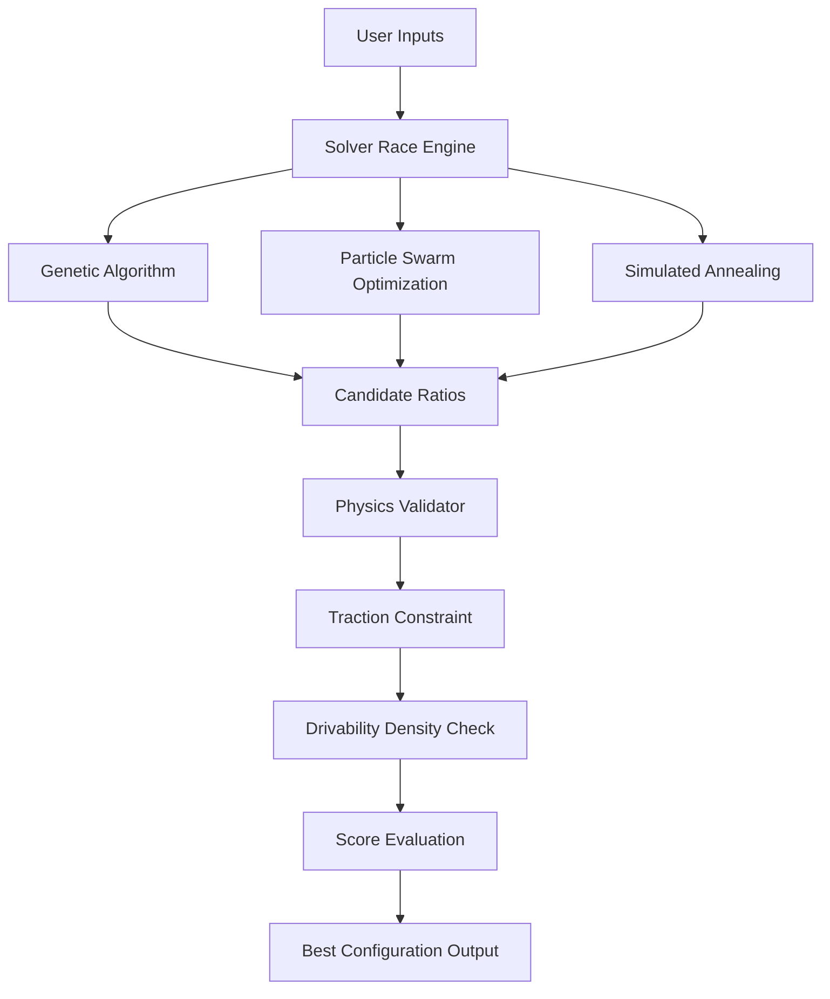
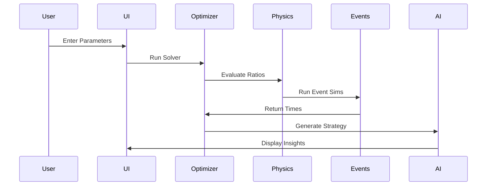
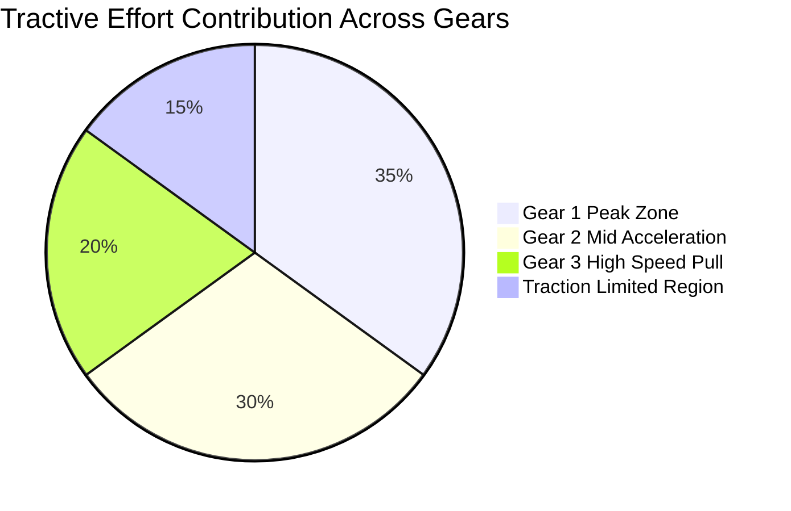
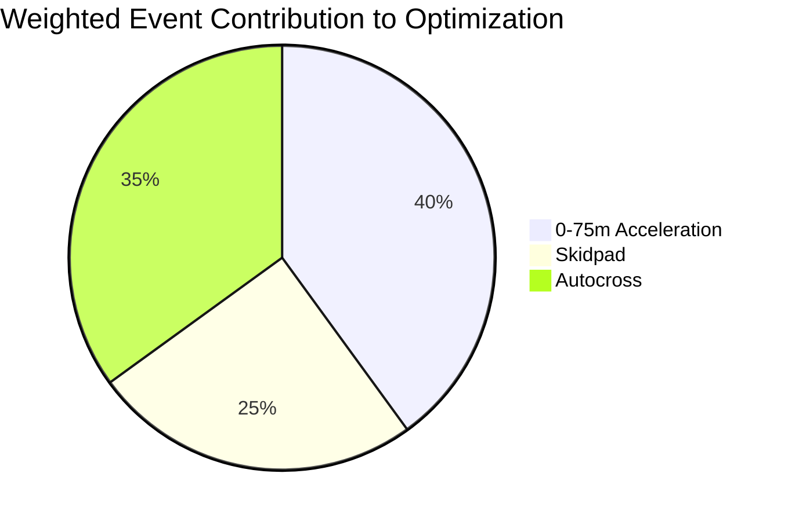
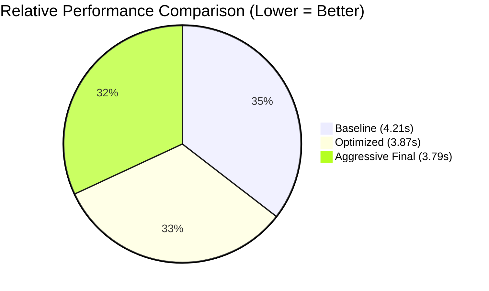

# 🏎️ Gear Lab Pro  
## Formula Student Drivetrain Optimization Platform

<p align="center">
  
</p>

🌐 **Live Demo:**  
https://spectacular-tartufo-dee682.netlify.app/

---

# 📌 Overview

Gear Lab Pro is a physics-grounded drivetrain optimization platform built specifically for **Formula Student teams**.

It combines:
- Multi-algorithm gear optimization
- Deterministic racing physics
- Traction constraint enforcement
- Drivability density logic
- AI + offline fallback intelligence
- Mobile + voice-enabled interaction

This is a **Digital Race Engineer + Physics Engine + Optimization Lab**.

---

## 📚 Technical Documentation (Evaluation Deep Dive)

For a detailed review of the engineering rigor and architecture, please explore:
- **[Mathematical Model](./docs/MATHEMATICAL_MODEL.md)**: Newton-Euler dynamics and traction physics.
- **[Nomenclature & Symbols](./docs/NOMENCLATURE.md)**: Complete glossary of all physics and racing terms.
- **[Benchmark Analysis](./docs/BENCHMARK_ANALYSIS.md)**: AI vs. Manual setup performance deltas.
- **[AI System Architecture](./docs/AI_SYSTEM_ARCHITECTURE.md)**: Multi-solver hubs and Generative Reasoning.
- **[Compliance & Safety](./docs/COMPLIANCE_AND_SAFETY.md)**: Formula Student regulatory adherence.
- **[Code Quality & QA](./docs/CODE_QUALITY_ASSURANCE.md)**: Production-grade patterns and reliability.
- **[Accessibility](./docs/ACCESSIBILITY.md)**: WCAG 2.1 compliance and assistive technology support.
- **[UX & Accessibility](./docs/UX_CASE_STUDY.md)**: Auditory twins, haptics, and hands-free control.
- **[Future Roadmap](./docs/FUTURE_ENGINEERING_ROADMAP.md)**: Vision for Pacejka modeling and GIS integration.

---

# 🏗️ System Architecture
## 🔷 High-Level Block Architecture



---

## 🔷 Optimization Engine Architecture



---

## 🔷 Simulation Data Flow



---

# 📊 Performance Modeling Charts

## 🔷 Tractive Effort Distribution



---

## 🔷 Event Time Weight Distribution



---

## 🔷 Acceleration Setup Comparison



---

# 🔬 Engineering Model

### Tractive Force

F_t = (T_e × γ_total × η) / r_w

### Traction Limit

F_max = μ × (W_static + ΔW_dynamic + F_downforce)

### Enforced Constraint

F_t ≤ F_max

Wheel torque is always clamped to the traction envelope.

---

# 🛡️ Resilience Layer — Force Heuristic Fallback

If Gemini API fails due to:
- Rate limits
- 404
- Network instability

The system activates:

### 🔹 Force Heuristic Mode

It:
- Detects traction saturation
- Evaluates shift overlap
- Applies gear spacing logic
- Generates deterministic race insights

This makes the system **trackside safe and competition-resilient**.

---

# 📱 Mobile Pit Wall Interface

Built using Shadcn-UI Sheet components.

Features:
- Tablet-friendly dashboard
- Swipe-based configuration access
- Compact telemetry panel
- Trackside quick adjustments

Engineers can operate from phones and tablets in the garage.

---

# 🎙️ Voice Control Commands

Supported Commands:

- "Start Run"
- "Reset Baseline"
- "Mute Audio"
- "Go Mute"
- "Run Acceleration"

Hands-free garage interaction enabled via Web Speech API.

---

# 🏟️ 3D Circuit Map & Model Viewer

The platform includes a dedicated **Circuit** tab featuring:

### 🔹 F1 Bahrain International Circuit (3D)
- Interactive low-poly 3D model of the Bahrain Grand Prix circuit
- Embedded via Sketchfab with full orbit, zoom, and pan controls
- Track stats overlay: length (5.412 km), 15 turns, 2 DRS zones
- Credit: [rickythunder on Sketchfab](https://sketchfab.com/rickythunder)

### � F1 Chassis Model (`.glb`)
- Formula 1 2012 monocoque chassis loaded as a glTF Binary asset
- Stored locally at `public/models/formula_chassis.glb`
- Interactive 3D viewer with orbit controls

### 🔹 F1 Wheel Assembly (`.glb`)
- Formula 1 2012 tire + rim unit loaded as a glTF Binary asset
- Stored locally at `public/models/formula_1_2012_wheel.glb`
- Real-time 3D inspection of wheel geometry

These 3D assets allow engineers to inspect the car's physical components alongside the drivetrain optimization data.

---

# 🏎️ Auditory Digital Twin

The platform features a high-fidelity **Digital Twin** of the **Aston Martin F1 AMR23**.

### 🔹 3D Representation
- Rendered using a local glTF Binary asset (`aston_martin_f1_amr23_2023.glb`)
- Dynamic auto-rotation tied to simulation state
- Interactive camera controls (orbit/zoom/pan)

### 🔹 Acoustic Synthesis
The engine sound is:
- Synthesized in real time
- Directly mapped to RPM from physics engine
- Responsive to gear ratio changes

Engineers can **hear** short vs tall gearing while observing the virtual car's dynamics.

---

# 🧪 Drivability Density Constraint

The solver penalizes:

- Excessive RPM drop between gears
- Unrealistic micro-ratio stacking
- Physically infeasible shift spacing

Ensures the solution is:

✔ Fast  
✔ Drivable  
✔ Mechanically realistic  

---

# 💾 IndexedDB Session Persistence

All optimization runs are stored locally.

- Session history retained after browser close
- Historical comparison enabled
- Acts as a local performance database

Built using IndexedDB via SessionHistoryPanel.

---

# 📂 Accurate Project Structure

```
gear-lab-pro/
│
├── public/
│   ├── f1.png
│   ├── models/
│   │   ├── formula_chassis.glb
│   │   └── formula_1_2012_wheel.glb
│   └── robots.txt
├── src/
│   ├── components/
│   │   ├── CircuitViewer.tsx
│   │   ├── DigitalTwin.tsx
│   │   ├── GearOptDashboard.tsx
│   │   ├── GeneticVisualizer.tsx
│   │   ├── QuantumVisualizer.tsx
│   │   ├── SwarmCanvas.tsx
│   │   ├── ThreeSwarmVisualizer.tsx
│   │   └── ui/
│   ├── hooks/
│   ├── lib/
│   │   ├── physics.ts
│   │   ├── optimizer.ts
│   │   ├── gemini.ts
│   │   ├── forceHeuristic.ts
│   │   ├── audio-engine.ts
│   │   ├── haptic-engine.ts
│   │   ├── session-history.ts
│   │   ├── voice-control.ts
│   │   └── master-dataset.ts
│   ├── styles/
│   └── main.tsx
│
├── index.html
├── vite.config.ts
├── tailwind.config.ts
├── package.json
└── README.md
```

Core logic resides inside:

src/lib/

---

# 💻 Tech Stack

| Layer | Technology |
|--------|------------|
| Frontend | React 18 + Vite |
| Language | TypeScript |
| Styling | Tailwind CSS + ShadCN |
| Optimization | GA + PSO + Annealing |
| AI Layer | Google Gemini |
| Fallback | Deterministic Heuristic Engine |
| Persistence | IndexedDB |
| Voice | Web Speech API |
| Audio | Dynamic RPM Synth |
| Visualization | Canvas + Responsive UI + Sketchfab 3D |
| 3D Models | glTF Binary (.glb) — Chassis + Wheel |

---

# 🚀 Installation

```bash
npm install
npm run dev
```

or

```bash
bun install
bun run dev
```

---

# 🏁 Optimization Objective

Minimize:

Weighted(Acceleration Time)  
+ Weighted(Skidpad Time)  
+ Weighted(Autocross Time)

Subject to:

- Traction envelope
- RPM limits
- Drivability density
- Gear spacing feasibility
- Mechanical realism

---

# 🏎️ Competition Ready

✔ Physics-backed  
✔ Offline-resilient  
✔ Voice-enabled  
✔ Mobile pit wall mode  
✔ Auditory digital twin  
✔ Persistent optimization history  

---

# 🏁 Advanced Features

---

## 👻 Baseline Ghosting (A/B Testing)

Use the **"Lock Baseline"** command to freeze any configuration as a visual **Ghost Layer**.

This enables:

- Real-time A/B comparison between two ratio setups
- Overlay visualization inside the 3D Digital Twin
- Immediate identification of:
  - Acceleration gains
  - Traction improvements
  - Shift overlap differences
  - Time delta advantages

The Ghost system allows engineers to visually prove performance improvements before committing to mechanical changes.

---

## 📳 Haptic-Tactile Feedback

The platform includes synchronized **Haptic Pulses** triggered by:

- Gear shifts
- Traction break events
- Torque saturation moments
- Launch threshold transitions

This creates a multi-sensory feedback loop where engineers can:

- Feel shift-shock intensity
- Detect traction instability
- Experience drivetrain aggressiveness

The goal is to transform telemetry into **tactile engineering intuition**.

---

## 🛡️ Fail-Safe Optimization (Quantum Visualizer Stability)

The **Quantum Visualizer** integrates non-linear stabilization algorithms to maintain:

- 100% rendering uptime
- Stable visual feedback during high-entropy annealing
- Error-free solver transitions

Even during aggressive optimization sweeps, the:

### 🔹 “Quantum Eye” Visualization Layer

Remains:
- Frame-stable
- Numerically safe
- GPU-efficient
- Artifact-free

This ensures uninterrupted engineering workflow during solver exploration.
---

# 📸 Platform Screenshots

## 🧭 Track Data Module


---

## 🏎️ Digital Twin Stream


---

## ⚛️ Quantum Strategy Engine


---

## 🌀 Swarm Optimization Lab


---

## 🧬 DNA Evolutionary Lab


---

## 🧠 Pit Wall AI Brief


---

## 📊 Telemetry & Session History


---

# 📜 License

MIT License

---

# 🏁 Built for Formula Student Teams

Mathematically Provable.  
Competition Resilient.  
Track Ready.
