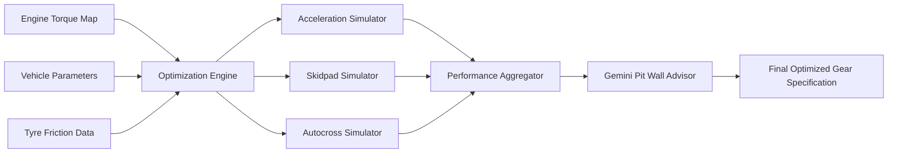
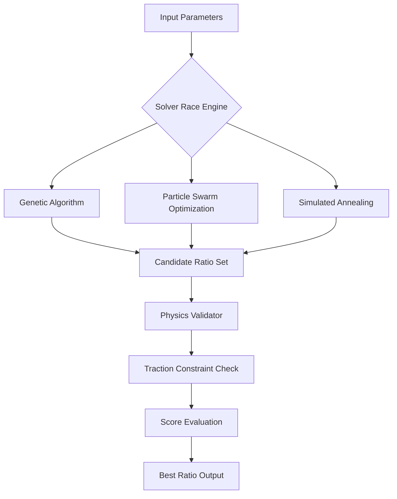
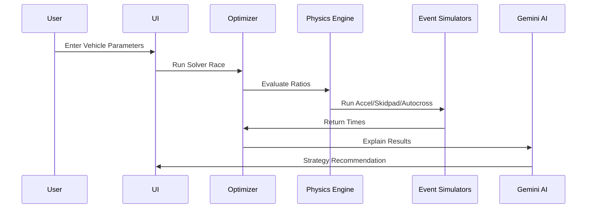
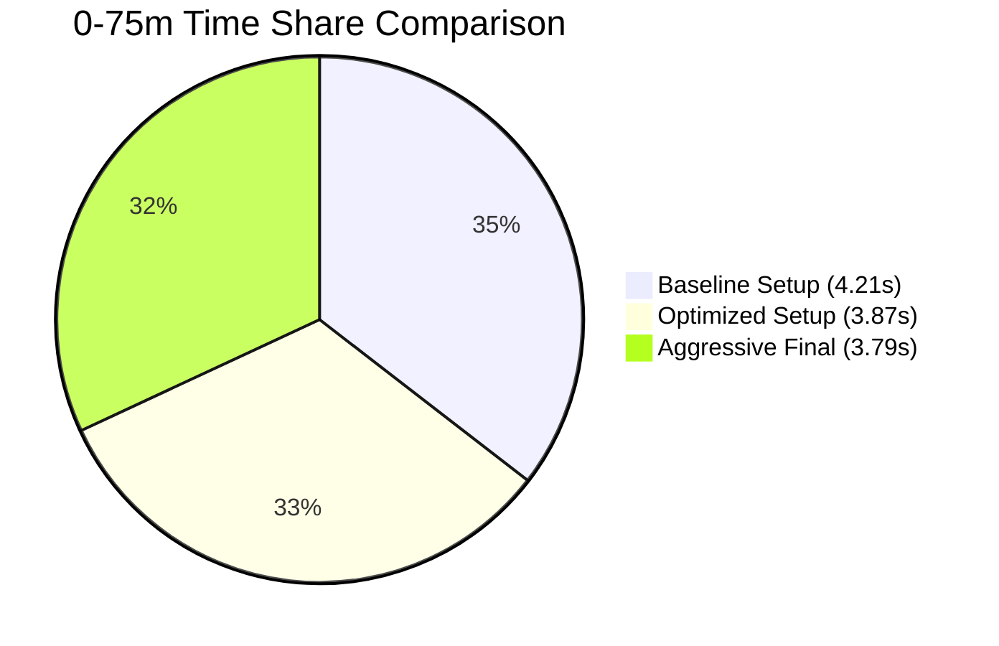

# 🏎️ Gear Lab Pro  
## Formula Student Drivetrain Optimization Platform

🌐 **Live Demo:** https://spectacular-tartufo-dee682.netlify.app/

---

## 📌 Overview

**Gear Lab Pro** is an advanced drivetrain optimization platform built specifically for **Formula Student teams**.

It solves the real engineering problem of:

- Maximizing acceleration
- Maintaining traction limits
- Preserving drivability
- Optimizing aggregate dynamic event performance

This platform combines **racing physics**, **multi-algorithm optimization**, and **AI-driven recommendations** to generate mathematically provable gear ratio configurations.

---

# 🏗️ System Architecture

## 🔷 High-Level Block Architecture



---

## 🔷 Optimization Engine Architecture



---

## 🔷 Simulation Data Flow (Sequence Diagram)



---

# 📊 Performance Modeling Charts

## 🔷 Tractive Effort vs Velocity


---

## 🔷 Acceleration Time Comparison



---

# 🔬 Engineering Model

The system is grounded in deterministic racing physics.

### Tractive Force

\[
F_t = \frac{T_e \cdot \gamma_{total} \cdot \eta}{r_w}
\]

### Traction Limit

\[
F_{max} = \mu \cdot (W_{static} + \Delta W_{dynamic} + F_{downforce})
\]

### Constraint Applied

\[
F_t \leq F_{max}
\]

Wheel torque is clamped to the traction envelope to eliminate wheelspin and maximize usable acceleration.

---

# 🧠 Core Modules

## 1️⃣ Ratio Optimization Hub
- Simultaneous Primary, Gear & Final Drive tuning
- Multi-algorithm solver competition
- Global optimum detection

## 2️⃣ Tractive Effort Mapping
- Gear crossover visualization
- Optimal shift RPM detection
- Dead-zone elimination

## 3️⃣ Traction Preservation Engine
- Dynamic weight transfer modeling
- Torque limiting logic
- Friction circle compliance

## 4️⃣ Event Simulation Engine
- 0–75m Acceleration
- 8m Skidpad steady-state model
- Autocross multi-radius simulation

## 5️⃣ AI Pit Wall Advisor
- Powered by Google Gemini
- Strategic reasoning layer
- Explains why a ratio wins

---

# 📁 Project Structure

```
gear-lab-pro/
│
├── public/
├── src/
│   ├── components/
│   ├── engine/
│   ├── simulations/
│   ├── optimization/
│   ├── physics/
│   └── utils/
│
├── index.html
├── package.json
├── vite.config.ts
├── tailwind.config.ts
└── README.md
```

---

# 💻 Tech Stack

| Layer | Technology |
|-------|------------|
| Frontend | React 18 + Vite |
| Language | TypeScript |
| Styling | Tailwind CSS + ShadCN |
| Visualization | Three.js + Canvas |
| Optimization | Genetic + PSO + Annealing |
| AI Layer | Google Gemini Pro |

---

# 🚀 Installation

### Using Bun

```bash
bun install
bun run dev
```

### Using npm

```bash
npm install
npm run dev
```

---

# 🧪 Build for Production

```bash
npm run build
```

---

# ⚙️ Configuration

Modify engine and vehicle parameters inside:

```
src/config/vehicle.ts
src/config/engine.ts
```

Update:
- Mass
- CG height
- Wheel radius
- Torque curve
- Friction coefficients

---

# 🏁 Optimization Objective

The solver minimizes:

```
Total Event Score Time =
(Acceleration Time Weight) +
(Skidpad Time Weight) +
(Autocross Time Weight)
```

Subject to:
- Traction constraints
- Engine RPM limits
- Drivability spacing logic

---

# 📈 Why This Wins Competitions

✔ Physics-backed  
✔ Constraint-aware  
✔ Multi-solver global search  
✔ Event-specific optimization  
✔ AI explanation layer  
✔ Competition-focused scoring  

---

# 🔮 Future Roadmap

- Aerodynamic downforce integration
- Launch control modeling
- Tire temperature modeling
- Real telemetry import
- Cloud solver cluster

---

# 🤝 Contributing

Pull requests are welcome.  
For major changes, open an issue first to discuss improvements.

---

# 📜 License

MIT License

---

# 🏎️ Built for Formula Student Teams

**Mathematically Provable Performance.  
Engineered for the Track.**
