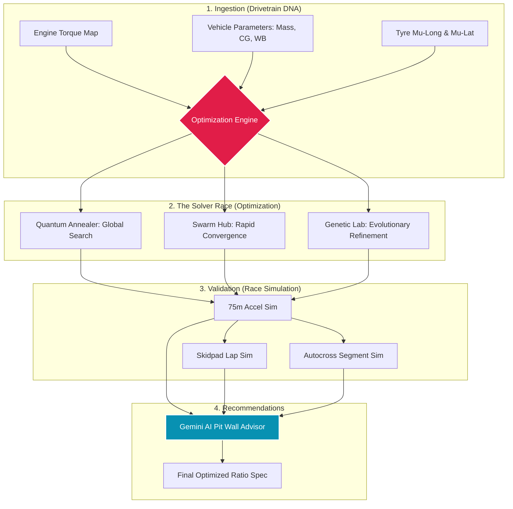

# 🏎️ Gear Lab Pro: Formula Student Drivetrain Optimizer

**Gear Lab Pro** is a high-performance optimization platform engineered specifically for **Formula Student** competition. It solves the complex engineering challenge of configuring a drivetrain that maximizes acceleration and event efficiency while adhering to strict traction limits and drivability requirements.

---

## 🏁 The Problem Statement
Design and develop an optimized gear ratio configuration platform for a Formula Student drivetrain that:
1.  **Maximizes acceleration performance** and overall event efficiency.
2.  **Maintains traction limits** (ensures wheel torque does not exceed tyre friction).
3.  **Preserves drivability** through logical ratio spacing.
4.  Provides **data-driven recommendations** for ratio selection that improves overall competition performance.

---

## 🛠️ Core Capabilities
The platform addresses the competition requirements through five primary engineering modules:

### 1. Ratio Optimization Hub (Primary, Gear, Final)
The system determines the optimal **Primary**, **Individual Gear**, and **Final Drive** ratios simultaneously. It doesn't just tune one ratio; it uses a "Solver Race" of Quantum, Swarm, and Genetic AI to sweep the entire solution space, finding the global peak of performance relative to the engine's specific torque curve.

### 2. Tractive Effort & Velocity Modeling
*   **Dynamic Force Mapping**: Models tractive effort vs. vehicle speed across all gears in real-time.
*   **Optimal Shift Points**: Identifies the exact RPM for each gear change to ensure the vehicle stays at its maximum power-to-ground potential.
*   **Interactive Tractive Force Map**: Visualizes the crossover points between gears to minimize "dead zones" in the acceleration curve.

### 3. Traction Preservation Engine
A fundamental rule of racing is: *Power is nothing without traction.*
*   **Grip Limit Monitoring**: The simulator calculates the maximum possible traction based on dynamic weight transfer ($\mu \cdot W_{dynamic}$).
*   **Torque Capping**: The AI solvers are constrained to ensure that delivered wheel torque never exceeds the tire's traction limit, preventing inefficient wheelspin and maximizing forward "bite."

### 4. Event-Specific Simulation
The platform simulates the three core Formula Student dynamic events to compare the time outcomes of different setups:
*   **0–75m Acceleration**: High-fidelity longitudinal simulation.
*   **Skidpad (8m Constant Radius)**: Calculates steady-state lateral acceleration and lap times.
*   **Autocross**: A multi-segment simulation including straights and varying corner radii (10m, 15m) to test the setup's overall agility and power delivery.

### 5. Data-Driven Recommendations (Pit Wall AI)
Powered by **Google Gemini Pro**, the "Pit Wall Advisor" acts as a virtual Race Engineer. It synthesizes the simulation telemetry into actionable recommendations, explaining *why* a specific ratio set (e.g., a 4.10 final drive vs. a 3.90) will yield a faster aggregate score across all competition events.

---

## 📊 Architecture Diagram

---

## 🔬 Technical Justification
The platform is built on deterministic racing physics:

*   **Tractive Force:** $F_t = (T_e \cdot \gamma_{total} \cdot \eta) / r_w$
*   **Traction Limit:** $F_{max} = \mu \cdot (W_{static} + \Delta W_{dynamic} + F_{downforce})$
*   **The constraint:** $F_t$ is always clamped at $F_{max}$ to ensure the result is physically achievable on the track.

---

## 💻 Tech Stack
- **Frontend**: React 18, Vite, TypeScript.
- **Visualization**: Three.js (Digital Twin), HTML5 Canvas (AI Solver HUDs).
- **Intelligence**: Google Gemini Pro (Strategic Synthesis).
- **Styling**: Tailwind CSS & Shadcn-UI (High-Density F1 Aesthetics).

---

**Engineered for Formula Student Teams.**  
*Mathematically Provable Performance.*
