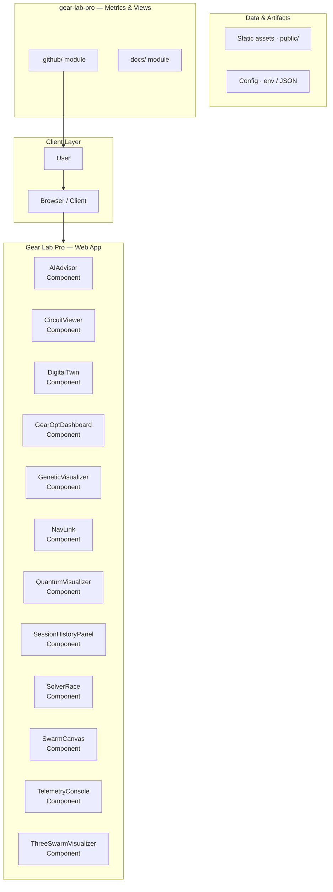
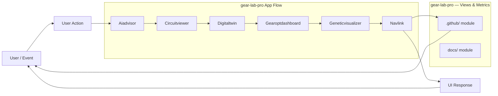
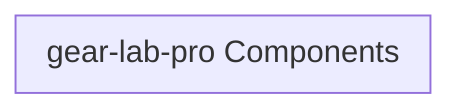
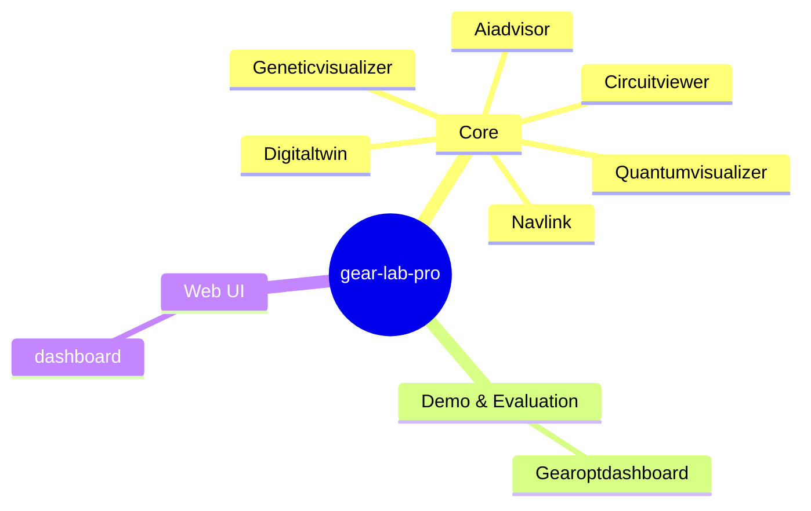
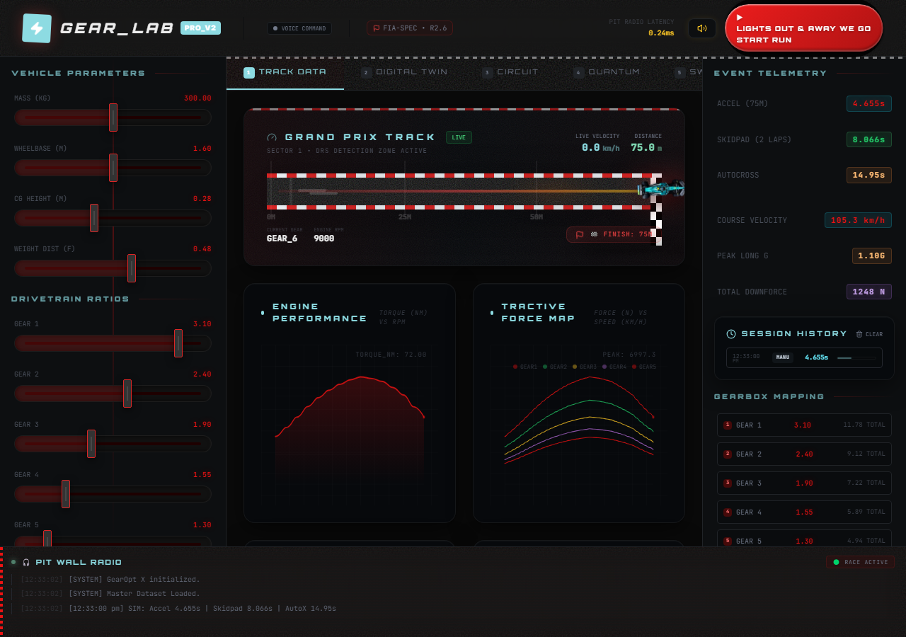

# Advanced Multi-Agent Simulation and Reasoning Platform

A sophisticated, full-stack application designed to simulate complex physical systems and utilize multi-level AI reasoning (Heuristic Solvers and LLMs) to derive optimal solutions.

## Overview

The project implements a highly complex, bi-level AI system. The core functionality involves running multiple competing optimization algorithms (Solver Race) within a simulated physics environment. The results of this low-level simulation are then passed to a high-level Generative AI model (Gemini Pro) for contextual reasoning and validation. The architecture is designed to handle high-frequency state updates, persistent memory, and complex user interactions, leveraging modern React state management and visualization libraries.

## Problem

The system aims to solve complex, multi-variable optimization problems that require both rigorous, deterministic physical simulation (low-level heuristics) and abstract, contextual reasoning (high-level generative AI).

## Solution

The solution is a modular, multi-agent architecture. It uses a 'Solver Race' to test various optimization strategies (e.g., Annealing, PSO, Genetic) against a defined physical sandbox. The best candidate solution is then passed to a Retrieval-Augmented Telemetry (RAT) pipeline, which queries long-term memory and feeds the context to Gemini Pro for final, human-readable reasoning and validation.

## Key Features

- Multi-Agent Optimization Solver Race (Annealing, PSO, Genetic)
- Physics Sandbox Simulation (Deterministic validation)
- High-Level Generative Reasoning via Gemini Pro (LLM integration)
- Retrieval-Augmented Telemetry (RAT) for context grounding
- Long-Term Memory Persistence using IndexedDB
- Interactive Data Visualization (Charting and 3D rendering)
- Modular UI Components (Shadcn/ui, Radix primitives)

## Technology Stack

- React
- React Router DOM
- Tailwind CSS
- TypeScript
- @tanstack/react-query
- Zod
- Three.js
- @react-three/fiber
- @react-three/drei
- @visx/*

This is precisely the architectural step we need. Focusing on the **Simulation State Manager** is the correct move. It establishes the single source of truth, which is critical for decoupling the complex logic of the Genetic Algorithm (GA) and the Physics Engine. By formalizing the state management layer first, we ensure that both modules operate against a predictable, versioned data contract, dramatically improving testability and stability.

**Please proceed with drafting the TypeScript interfaces and the initial class structure for the Simulation State Manager and its IndexedDB integration.**

To ensure the resulting foundation is maximally robust, please ensure the following elements are prioritized in the initial draft:

### 1. State Definition (`IState` Interface)
*   The interface must be comprehensive, encompassing all major components of the simulation (e.g., `Population[]`, `PhysicsParameters`, `DigitalTwinState`, `SimulationMetadata`).
*   It should include mechanisms for versioning or timestamping to track state changes.

### 2. Persistence Layer (`IndexedDBWrapper`)
*   The class structure should handle asynchronous read/write operations (`getState()`, `saveState(state: IState)`).
*   It must include robust error handling for database connection failures or schema mismatches.

### 3. Event Dispatching
*   The State Manager should act as the central event emitter. Any successful state mutation (e.g., `STATE_UPDATED`, `POPULATION_GENERATION_COMPLETE`, `PHYSICS_STEP_COMPLETE`) must dispatch a standardized event. This allows the GA and Physics modules to subscribe to changes without directly calling each other.

***

### Next Steps After State Manager Implementation

Once the State Manager is stable, we can proceed with the implementation in a controlled, iterative manner:

1.  **Physics Module Integration:** Implement the `PhysicsEngine` class, ensuring that its primary method (`stepSimulation`) reads the current state from the State Manager and writes the updated physical coordinates/metrics back to it.
2.  **GA Module Integration:** Implement the `GeneticAlgorithm` class, ensuring its core loop (`runGeneration`) reads the population data, performs mutations/selections, and writes the new population state back to the State Manager.
3.  **Orchestrator/Main Loop:** Finally, we will build the main `SimulationOrchestrator` class. This class will manage the sequence of events (e.g., `[Initialize] -> [Physics Step] -> [GA Cycle] -> [Physics Step] -> ...`) and will be responsible for calling `StateManager.saveState()` at the end of each major cycle.

I look forward to reviewing the initial State Manager draft.

## Setup Guide

### Frontend Setup

```bash

npm install
npm run dev     # development
npm run build && npm start   # production
```

Open `http://127.0.0.1:5173` (or the port shown in the terminal).

### Running the Application

1. **Start web app** — `npm run dev` in `./`

```bash
cd .
npm install
npm run dev
```

## System Architecture

High-level system design, data flows, API map, and workflow pipelines derived from the repository structure.

### System Architecture


```mermaid
graph TB
    subgraph Client["Client Layer"]
        user["User"]
        browser["Browser / Client"]
    end

    subgraph Core["Gear Lab Pro — Web App"]
        AIAdvisor["AIAdvisor<br/>Component"]
        CircuitViewer["CircuitViewer<br/>Component"]
        DigitalTwin["DigitalTwin<br/>Component"]
        GearOptDashboard["GearOptDashboard<br/>Component"]
        GeneticVisualizer["GeneticVisualizer<br/>Component"]
        NavLink["NavLink<br/>Component"]
        QuantumVisualizer["QuantumVisualizer<br/>Component"]
        SessionHistoryPanel["SessionHistoryPanel<br/>Component"]
        SolverRace["SolverRace<br/>Component"]
        SwarmCanvas["SwarmCanvas<br/>Component"]
        TelemetryConsole["TelemetryConsole<br/>Component"]
        ThreeSwarmVisualizer["ThreeSwarmVisualizer<br/>Component"]
    end

    subgraph Data["Data & Artifacts"]
        assets["Static assets · public/"]
        config["Config · env / JSON"]
    end

    subgraph Charts["gear-lab-pro — Metrics & Views"]
        _github[".github/ module"]
        docs["docs/ module"]
    end

    user --> browser
    browser --> Core
    _github --> user
```

### Data Flow & Charts Pipeline


```mermaid
flowchart LR
    U["User / Event"] --> IN["User Action"]

    subgraph Pipeline["gear-lab-pro App Flow"]
        p0["Aiadvisor"]
        p1["Circuitviewer"]
        p2["Digitaltwin"]
        p3["Gearoptdashboard"]
        p4["Geneticvisualizer"]
        p5["Navlink"]
        p0 --> p1
        p1 --> p2
        p2 --> p3
        p3 --> p4
        p4 --> p5
    end

    subgraph Metrics["gear-lab-pro — Views & Metrics"]
        _github[".github/ module"]
        docs["docs/ module"]
    end

    IN --> p0
    p5 --> OUT["UI Response"]
    OUT --> U
    p5 --> _github
    _github --> U
```

### Component & API Map


```mermaid
graph LR
    subgraph App["gear-lab-pro Components"]
    end
```

### Application Page Map


```mermaid
mindmap
  root((gear-lab-pro))
    Core
      Aiadvisor
      Circuitviewer
      Digitaltwin
      Geneticvisualizer
      Navlink
      Quantumvisualizer
    Demo & Evaluation
      Gearoptdashboard
    Web UI
      dashboard
```

## Screenshots & Assets


## Application Pages

Screenshots captured from the running application. Each page is listed with its function.

### Application

#### Home

Home — application page at `/`


