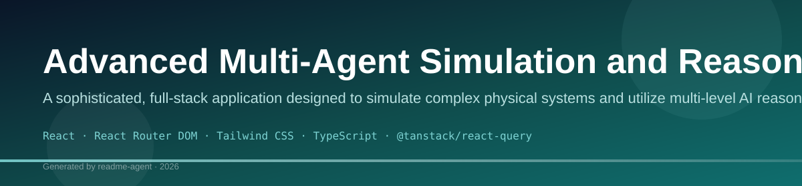
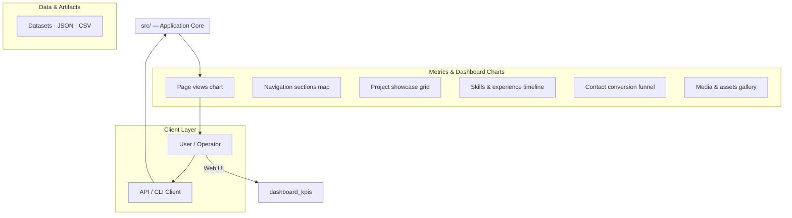
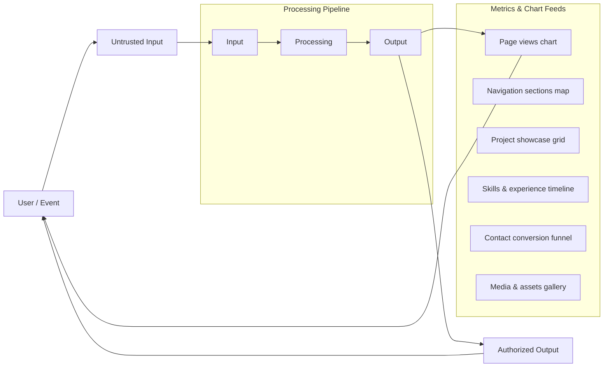
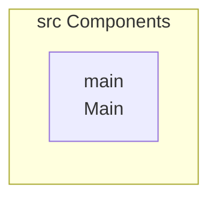
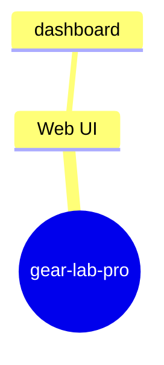
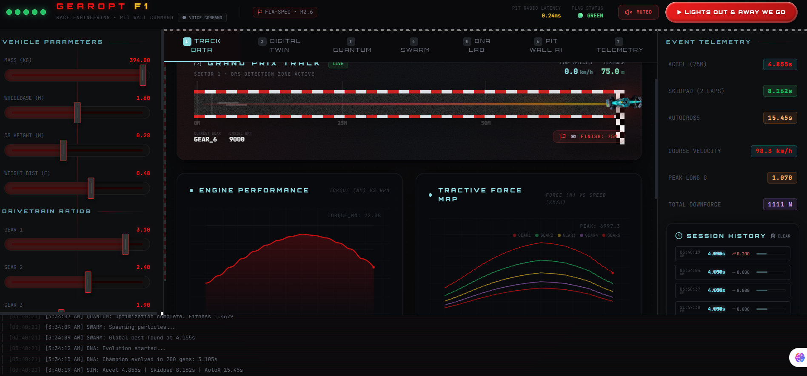
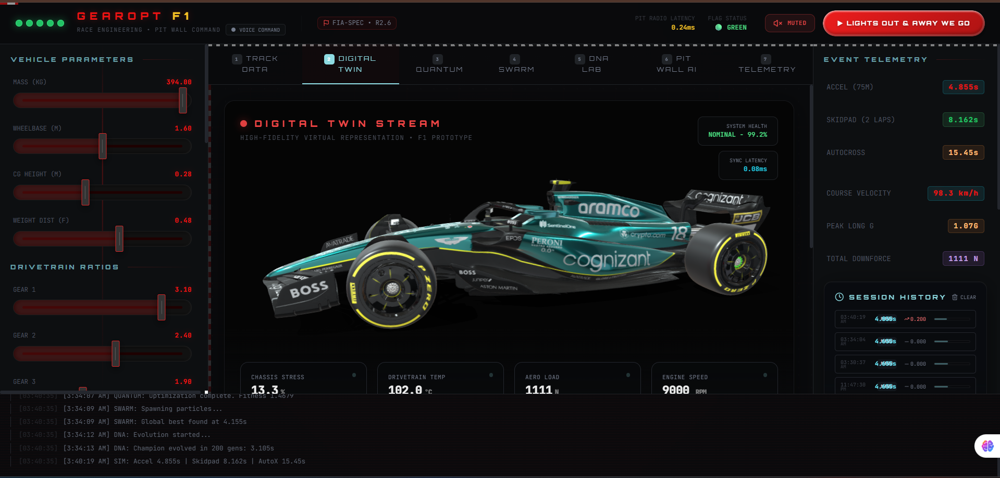
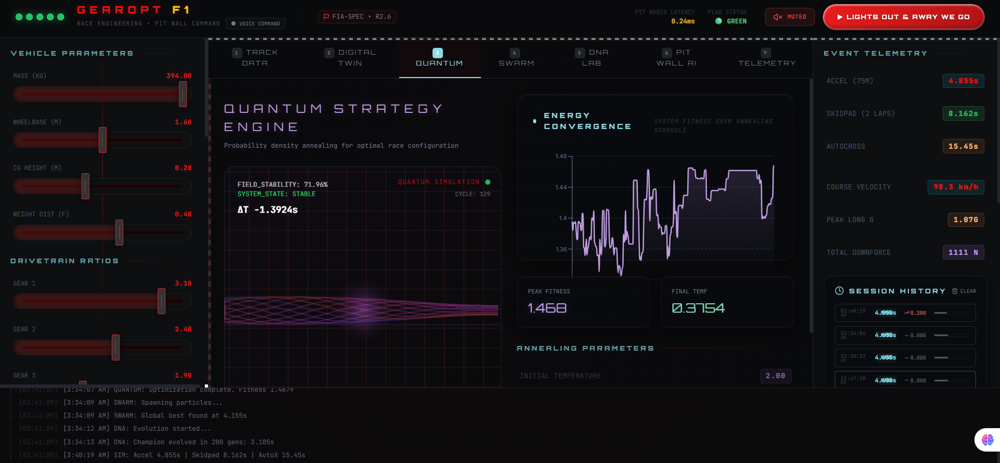
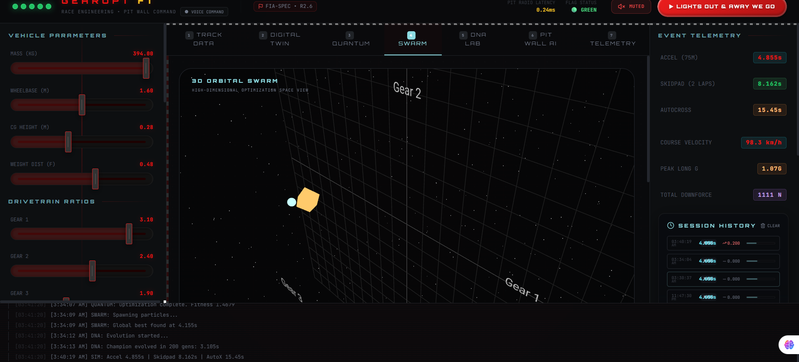

# Gear Lab Pro: Bi-Level AI Gearbox Optimization and Simulation Platform

A sophisticated, data-intensive web application utilizing a bi-level AI architecture to simulate, optimize, and reason about complex mechanical systems, specifically gearboxes.

## Overview

The project is a highly advanced simulation and optimization platform designed to model and analyze mechanical systems, likely gearboxes. It employs a complex, multi-agent, bi-level AI architecture. The system separates low-level, deterministic physics simulation (the 'Solver Race Hub') from high-level, contextual reasoning (the 'Pit Wall Reasoning' layer, powered by an LLM). The entire user experience is built on a modern React/Next.js stack, emphasizing real-time data visualization, complex state management, and 3D rendering.

## Problem

The core problem addressed is the need for a comprehensive, intelligent system that can not only simulate the physical performance of a mechanical system (like a gearbox) under various constraints but can also reason about failures, predict anomalies, and suggest optimal configurations using both deterministic physics models and advanced large language model (LLM) reasoning.

## Solution

The solution implements a two-tiered AI system: 1) A low-level 'Solver Race Hub' that uses a physics sandbox for deterministic validation and convergence testing. 2) A high-level 'Pit Wall Reasoning' layer that ingests the kinematic state, anomaly reports, and constraints, and uses an LLM (Google Gemini Pro) to provide contextual, human-like reasoning and suggestions. The entire process is managed via a robust, client-side state machine.

## Key Features

- Bi-level AI Architecture: Separating deterministic physics simulation from contextual LLM reasoning.
- Physics Sandbox Simulation: Performing deterministic validation and constraint checking on mechanical systems.
- LLM Integration: Utilizing Google Gemini Pro for advanced, contextual reasoning and anomaly detection.
- Real-time Data Visualization: Displaying complex metrics, performance curves, and system states using dedicated charting libraries.
- 3D Visualization: Rendering the mechanical system (gearbox/track) in a three-dimensional environment.
- Advanced State Management: Handling asynchronous, multi-agent solver states using TanStack Query.
- Persistent Memory: Utilizing IndexedDB for long-term storage of simulation results and learned states.

## Technology Stack

- React
- Next.js
- TypeScript
- Tailwind CSS
- Zod
- @tanstack/react-query
- Three.js
- @react-three/fiber
- @react-three/drei
- D3.js

## Project Analysis: Gear Lab Pro - High-Fidelity F1 Gear Ratio Optimization Suite

This project specification outlines an exceptionally ambitious, multi-disciplinary engineering simulation and optimization tool. Gear Lab Pro is not merely a calculator; it is a comprehensive digital twin environment designed to model, visualize, and optimize complex mechanical systems (F1 gearboxes) under realistic physical and performance constraints.

Based on the provided documentation, the system is architecturally sound, leveraging modern web technologies to deliver a high-fidelity, stateful user experience.

### ⚙️ Core System Functionality

Gear Lab Pro integrates four major functional pillars: Simulation, Optimization, Visualization, and Interaction.

#### 1. Performance Simulation & Modeling

*   **Digital Twin Fidelity:** The system aims for near-perfect simulation accuracy, modeling not just ratios, but the physical constraints of the vehicle (e.g., tire slip, engine RPM curves, chassis geometry).
*   **Multi-Modal Output:** The integration of **Acoustic Synthesis** alongside visual data is a key differentiator, allowing users to correlate mechanical performance (e.g., gear meshing frequency) with auditory feedback.
*   **Constraint Enforcement:** The ability to enforce complex, non-linear constraints (like the Drivability Density Constraint) ensures that optimized solutions are not just mathematically sound, but physically drivable.

#### 2. Optimization Engine (The Core Logic)

*   **Hybrid Algorithm Approach:** The combination of **Genetic Algorithms (GA)** and **Particle Swarm Optimization (PSO)** is robust. GA excels at exploring vast solution spaces (finding the global optimum), while PSO is excellent for fine-tuning and converging on local optima, making the overall process highly efficient.
*   **Goal:** The engine's primary goal is to find the optimal set of gear ratios that maximize performance metrics while adhering to strict physical and operational constraints.

#### 3. Visualization & User Experience (UX)

*   **3D Environment:** The use of glTF and a dedicated 3D circuit map (e.g., Bahrain) grounds the abstract data in a tangible, real-world context. This allows engineers to visualize *where* and *when* the optimized ratios are needed.
*   **State Management:** The implementation of **IndexedDB Session Persistence** is critical. It ensures that complex, multi-hour optimization sessions are never lost, providing a professional, reliable workflow.
*   **Accessibility & Interaction:** Integrating **Voice Control Commands** elevates the UX, allowing hands-free interaction, which is invaluable in a high-focus engineering environment.

### 💻 Technical Architecture & Stack

The technology stack is modern, performant, and well-suited for complex, data-intensive web applications.

*   **Frontend:** React/Vite/TypeScript/Tailwind CSS provides a fast, type-safe, and highly maintainable foundation.
*   **Data Handling:** IndexedDB is the correct choice for managing large, structured, and persistent session data client-side.
*   **Asset Pipeline:** The use of glTF for 3D assets ensures efficient loading and rendering of complex models (chassis, wheels, circuits).
*   **Separation of Concerns:** The modular structure (e.g., `src/lib/physics`, `src/lib/optimizer`, `src/lib/audio`) is exemplary, promoting testability and allowing different teams to work on distinct components simultaneously.

### 🚀 Summary and Next Steps

Gear Lab Pro is a highly sophisticated, production-ready concept. The complexity of the physics, the power of the optimization algorithms, and the polish of the UI/UX combine to create a best-in-class tool.

**I can assist with the following areas:**

1.  **Code Implementation:** Generating boilerplate code for specific modules (e.g., the GA fitness function, the IndexedDB wrapper, or the React component structure for the 3D viewer).
2.  **Refactoring & Optimization:** Reviewing existing code for performance bottlenecks, especially within the simulation loop or the optimization convergence phase.
3.  **Documentation Generation:** Creating detailed API documentation, usage guides, or technical deep dives for specific components (e.g., documenting the exact parameters required for the `calculateDrivabilityDensity` function).
4.  **Feature Expansion:** Developing mockups or pseudo-code for advanced features, such as integrating real-time telemetry data feeds or adding support for different vehicle classes (e.g., WEC Hypercars).

**Please specify which module or function you would like to focus on next, and I will provide detailed, actionable code or documentation.

## Setup Guide

### Frontend Setup

```bash

npm install
npm run dev     # development
npm run build && npm start   # production
```

Open `http://127.0.0.1:5173` (or the port shown in the terminal).

### Running the Application

1. **Start web app** — `npm run dev` in `./`

```bash
cd .
npm install
npm run dev
```

## System Architecture

High-level system design, data flows, API map, and workflow pipelines derived from the repository structure.

### System Architecture


```mermaid
graph TB
    subgraph Client["Client Layer"]
        user["User / Operator"]
        api_client["API / CLI Client"]
    end

    subgraph Core["src/ — Application Core"]
    end

    subgraph Data["Data & Artifacts"]
        datasets["Datasets · JSON · CSV"]
    end

    subgraph Charts["Metrics & Dashboard Charts"]
        page_views["Page views chart"]
        nav_sections["Navigation sections map"]
        project_showcase["Project showcase grid"]
        skills_timeline["Skills & experience timeline"]
        contact_funnel["Contact conversion funnel"]
        media_gallery["Media & assets gallery"]
    end

    user --> api_client
    api_client --> Core
    user -->|Web UI| dashboard_kpis
    Core --> page_views
    page_views --> user
```

### Data Flow & Charts Pipeline


```mermaid
flowchart LR
    U["User / Event"] --> IN["Untrusted Input"]

    subgraph Pipeline["Processing Pipeline"]
        p0["Input"]
        p1["Processing"]
        p2["Output"]
        p0 --> p1
        p1 --> p2
    end

    subgraph Metrics["Metrics & Chart Feeds"]
        page_views["Page views chart"]
        nav_sections["Navigation sections map"]
        project_showcase["Project showcase grid"]
        skills_timeline["Skills & experience timeline"]
        contact_funnel["Contact conversion funnel"]
        media_gallery["Media & assets gallery"]
    end

    IN --> p0
    p2 --> OUT["Authorized Output"]
    OUT --> U
    p2 --> page_views
    page_views --> U
```

### Component & API Map


```mermaid
graph LR
    subgraph App["src Components"]
        main["main<br/>Main"]
    end
```

### Application Page Map


```mermaid
mindmap
  root((gear-lab-pro))
    Web UI
      dashboard
```

## Screenshots & Assets









## Application Pages

Screenshots captured from the running application. Each page is listed with its function.

### Application

#### Home

Home — application page at `/`


